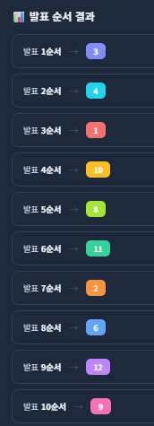

# AI 캠퍼스: AI 시스템반도체 설계 2기

이 repo는 AI 시스템반도체 설계 2기 과정 운영을 위한 것입니다.

## 발표 일정: 9/29

### 1. 09:10 ~ 09:20: 준비시간
### 2. 09:20 ~ 12:50: 오전 발표 (8개 팀)
### 3. 12:50 ~ 14:00: 점심
### 4. 14:00 ~ 16:00: 오후 발표 (4개 팀)
### 5. 16:00 ~ 16:50: 최종 결과물 제출 및 보드 반납

### 발표 규칙
- 발표시간: 팀당 25분 (초과시 감점)
  - 발표: 5분/인
  - Q&A + 소개 : 5분
  - 쉬는 시간 없이 진행합니다.
- 발표자료는 발표 전까지 공유드린 `project_folder`안 `발표자료`에 올려 주세요.
- **발표 순서**

  

### 최종결과물 제출
- `project_folder/최종결과물/<팀별 folder>`에 제출
- 제출 내용:
- AI_캠퍼스_2기_결과보고서(1팀).ppt
- AI_캠퍼스_2기_결과보고서(1팀).pdf
- AI_캠퍼스_2기_시연영상(1팀).mp4
- AI_캠퍼스_2기_결과파일(1팀).zip
  - 소스코드 (colab ipynb도 포함)
  - Train dataset
  - 그 외 프로젝트 진행 시 생성된 결과 파일들

## [Class Info](https://github.com/kcci-AI-campus/AI-campus-class)

## Classmates
|팀명|팀원|Project's repo|
|:---:|:---:|:---:|
|1팀|[강민수](https://github.com/kcci-AI-campus/00_KMS), [`강준호`](https://github.com/kcci-AI-campus/02_KJH), [견다혜](https://github.com/kcci-AI-campus/004_KDH), [고근영](https://github.com/kcci-AI-campus/05_GGY)|[Repo](https://github.com/kcci-AI-campus/Team-1-box-detection)|
|2팀|[곽지균](https://github.com/kcci-AI-campus/06_KJK), [`김동민`](https://github.com/kcci-AI-campus/07_KDM), [김동욱](https://github.com/kcci-AI-campus/00_KDU), [김동은](https://github.com/kcci-AI-campus/00_KDE)|[Repo](https://github.com/kcci-AI-campus/TEAM_2_DRIVER-SENSE)|
|3팀|[김성은](https://github.com/kcci-AI-campus/10_KSE), [김소영](https://github.com/kcci-AI-campus/11_KSY), [김유연](https://github.com/kcci-AI-campus/12_KYY), [`김하은`](https://github.com/kcci-AI-campus/13_KHE)|[Repo](https://github.com/kcci-AI-campus/Team-3)
|4팀|[노하영](https://github.com/kcci-AI-campus/13_NHY), [문준기], [`박건대`](https://github.com/kcci-AI-campus/16_PGD), [박경훈](https://github.com/kcci-AI-campus/17_PKH)|
|5팀|[박민기](https://github.com/kcci-AI-campus/00_PMK), [박소연](https://github.com/kcci-AI-campus/19_PSY), [`박승준`](https://github.com/kcci-AI-campus/20_PSJ), [박재균](https://github.com/kcci-AI-campus/21_PJG)|[Repo](https://github.com/kcci-AI-campus/Team5-sign2talk)|
|6팀|[`박제영`](https://github.com/kcci-AI-campus/22_PJY), [서도현](https://github.com/kcci-AI-campus/00_SDH), [서동진](https://github.com/kcci-AI-campus/23_SDJ), [서은랑](https://github.com/kcci-AI-campus/25_SER)|[Repo](https://github.com/kcci-AI-campus/Team6-Vision-Guard)|
|7팀|[`송정식`](https://github.com/kcci-AI-campus/26_SJS), [신동호](https://github.com/kcci-AI-campus/27_SDH), [오창민](https://github.com/kcci-AI-campus/28_OCM), [윤인수](https://github.com/kcci-AI-campus/29_YIS)|[Repo](https://github.com/kcci-AI-campus/Team-7)|
|8팀|[이광민](https://github.com/kcci-AI-campus/30_LKM), [`이시원`](https://github.com/kcci-AI-campus/31_LSW), [이재성](https://github.com/kcci-AI-campus/32_LJS), [조형성](https://github.com/kcci-AI-campus/41_JHS)|[Repo](https://github.com/kcci-AI-campus/Team8)|
|9팀|[이종혁](https://github.com/kcci-AI-campus/33_LJH), [`이주환`](https://github.com/kcci-AI-campus/34_LJH), [장세현](https://github.com/kcci-AI-campus/35_JSH)|[Repo](https://github.com/kcci-AI-campus/team-9-)|
|10팀|[정보윤](https://github.com/kcci-AI-campus/36_JBY), [정안성](https://github.com/kcci-AI-campus/37_JAS), [정준혁](https://github.com/kcci-AI-campus/38_JJH), [`강지연`](https://github.com/kcci-AI-campus/03_KJY)|[Repo](https://github.com/kcci-AI-campus/Team10)|
|11팀|[조수영](https://github.com/kcci-AI-campus/39_JSY), [`조원영`](https://github.com/kcci-AI-campus/40_WYCHO), [하기범](https://github.com/kcci-AI-campus/43_HKB), [한상훈](https://github.com/kcci-AI-campus/44_HSH)|[Repo](https://github.com/kcci-AI-campus/Team11-YLYL)|
|12팀|[최현서](https://github.com/kcci-AI-campus/46_HSC), [황영빈](https://github.com/kcci-AI-campus/45_HYB), [`황진하`](https://github.com/kcci-AI-campus/46_HJH)|[Repo](https://github.com/kcci-AI-campus/3d-hand-tracker-team-12)|